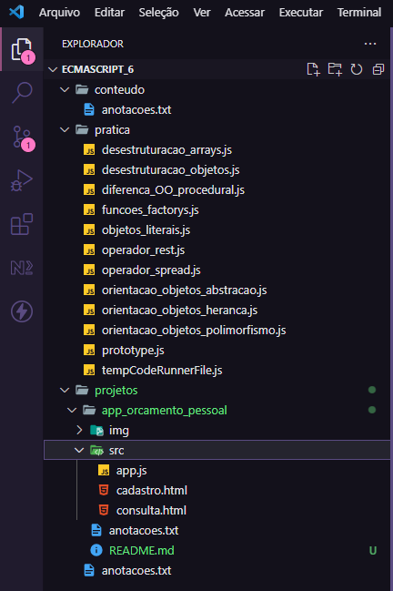
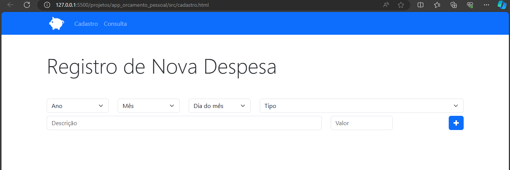
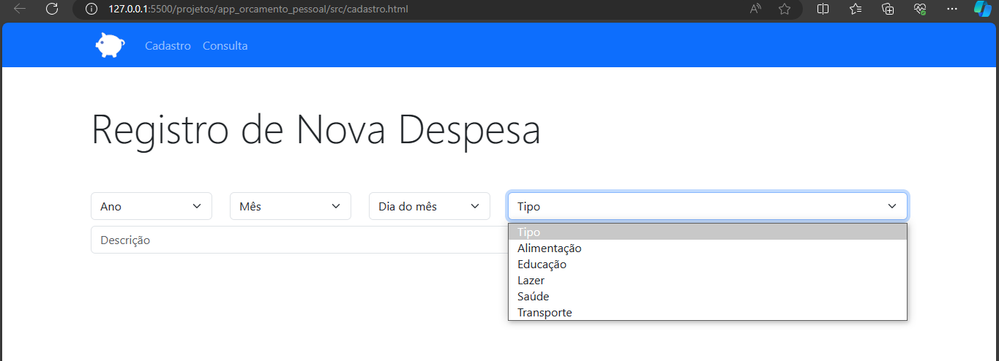
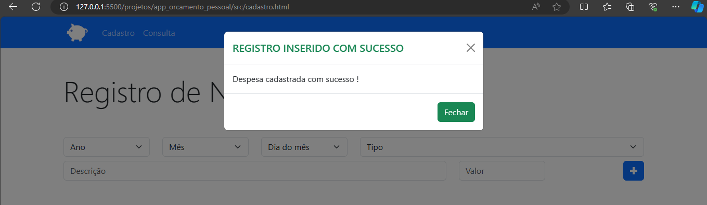
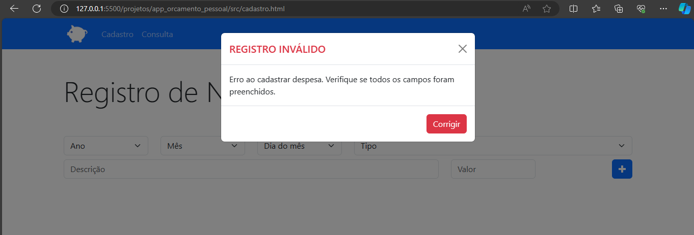
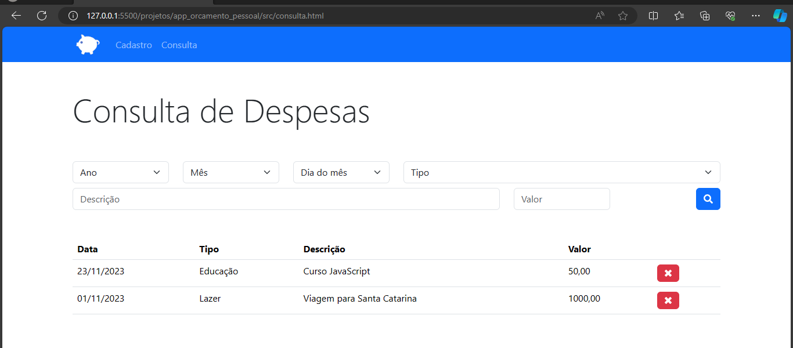
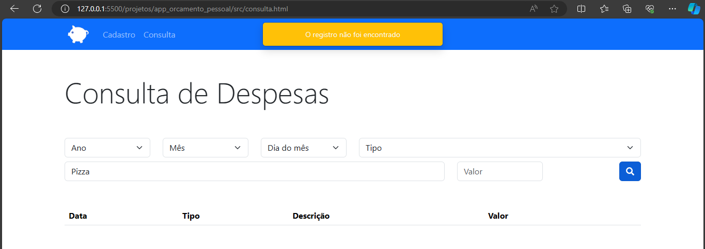
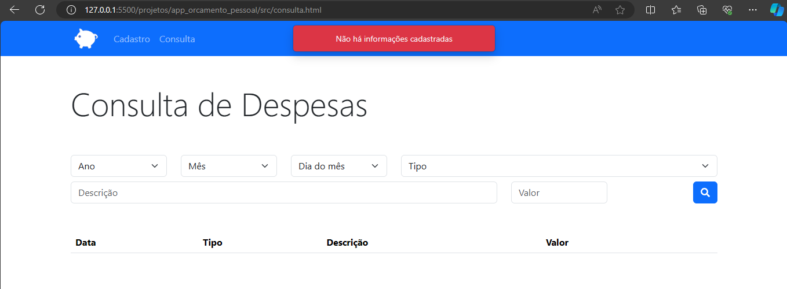

<h1 align="center"> ECMA SCRIPT - 6: FUNDAMENTOS, EXERCÍCIOS E PROJETOS </h1>

Esse projeto resume-se no aprendizado de JavaScript através dos seus fundamentos, exercícios e aplicação do conteúdo absorvido em projetos simples, porém, com foco na prática dos conhecimentos adquiridos.  

  

  <a href="#-tecnologias">Tecnologias</a>&nbsp;&nbsp;&nbsp;|&nbsp;&nbsp;&nbsp;
  <a href="#-objetivo-do-projeto">Objetivo do Porjeto</a>&nbsp;&nbsp;&nbsp;|&nbsp;&nbsp;&nbsp;
  <a href="#-como-utilizar">Como utilizar </a>&nbsp;&nbsp;&nbsp;|&nbsp;&nbsp;&nbsp;
  <a href="#-funcionalidades">Funcionalidades</a>&nbsp;&nbsp;&nbsp;|&nbsp;&nbsp;&nbsp;
  <a href="#-links">Links</a>&nbsp;&nbsp;&nbsp;

 

## 🚀 Tecnologias

Esse projeto foi desenvolvido com as seguintes tecnologias:

- HTML
- CSS
- JavaScript
- Bootstrap
- JQuery
- Fundamentos do ES-6

## 💻 Objetivo do Projeto

O projeto tem o objetivo de tornar acessível as informações sobre algumas tecnologias front-end para desenvolvedores que estão iniciando seus estudos. Nesse caso, iremos enfatizar fundamentos do JavaScript e as features do ES-6.  

É possível observar que outras tecnologias estarão presentes nos exercícios e projeto prático, mas o foco é o aprendizado do JS e sua prática para colaborar com a fixação do conteúdo.  

Para maior eficiência, sugiro a tentativa de aplicar os conceitos e não somente reescrever o material contido neste repositório.

## 👨‍💻 Como Utilizar

Para melhorar a compreensão e facilitar o manuseio do projeto, os assuntos foram divididos em algumas pastas que contêm matéria teórica e exemplos, exercícios, projeto e anotações.  

- A pasta "conteúdo" separa toda a matéria teórica e exemplos de aplicação;  
- A pasta "prática" armazena todos os exercícios para praticar os assuntos abordados;  
- A pasta "projetos" é sobre o projeto prático Orçamento Pessoal. Nela contém o arquivo .js para lógica e os arquivos .html referentes ao template da aplicação;  
- Por fim, o arquivo "anotações" é um direcionamento para iniciar a estruturação do seu programa.  

Veja a imagem abaixo:  

  

## 🛠 Funcionalidades

O projeto Orçamento Pessoal é uma forma para aplicar seus conhecimentos, porém, com um objetivo a parte de auxiliar no controle das finanças pessoais. Ressalto que a aplicação é simples, mas cumpre seu objetivo.  

Nela é possível cadastrar uma despesa, consultar os registros, filtrar e excluir:  
- O cadastro solicita as informações do ano, mês, dia, tipo de despesa, descrição e valor;  
    

      
      
      
      
    

     

- A consulta permite verificar todas as informações cadastradas;  
    

      
      
    

     

- Para filtrar um dado, pelo menos um campo do formulário precisa estar preenchido;  
    

      
    

     

- Ao excluir um registro, a lista é atualizada.  
    

      
    

     

Além dessas funcionalidades, modais de sucesso e aviso são renderizados à medida que um erro é capturado no preenchimento, ou na falta dele, ou na confirmação de todos os campos estarem completos. Notificações também são disparadas em casos de informações que não forem encontradas pelo filtro e quando um registro é excluído.  

## 🔗 Links

- Instalação do [VSCode](https://code.visualstudio.com/Docs)
- Documentação do [CSS](https://developer.mozilla.org/pt-BR/docs/Web/CSS)
- Documentação do [HTML](https://developer.mozilla.org/pt-BR/docs/Web/HTML)
- Documentação do [JS](https://developer.mozilla.org/pt-BR/docs/Web/JavaScript)
- Documentação da [Bootstrap](https://getbootstrap.com/docs/5.3/getting-started/introduction/)
- Documentação [JQuery](https://releases.jquery.com/jquery/)

